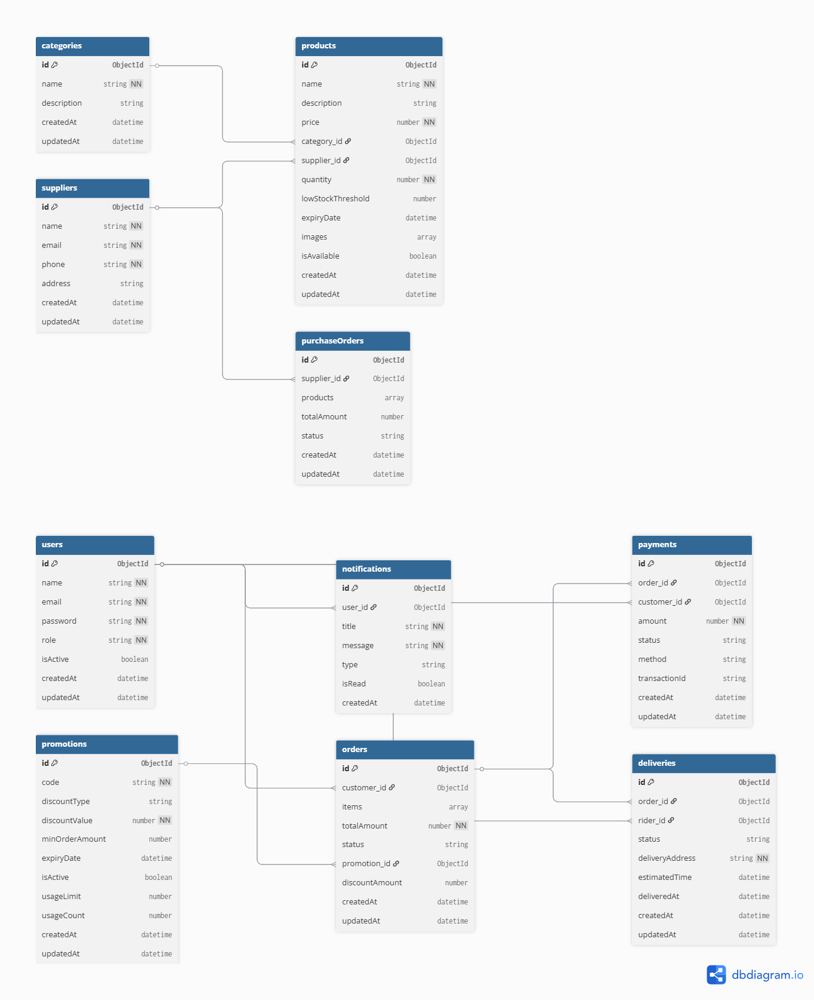

# 🛒 Supermarket Management System API

A RESTful API for an online supermarket management system
built with Node.js, Express and MongoDB.

---

## 📊 Database Design

View our full ERD here: [Database Diagram](https://dbdiagram.io/d/ERD-for-project-69fb02ea7a923b94722dda98)

---

## 👥 Team & Modules

| Person   | Role                 | Module                              |
| -------- | -------------------- | ----------------------------------- | ------------ |
| Person 1 | Project Lead         | Auth                                | DB Architect |
| Person 2 | Products & Inventory |
| Person 3 | Developer            | Orders & Payments                   |
| Person 4 | Developer            | Delivery, Customers & Suppliers     |
| Person 5 | Developer            | Promotions, Notifications & Reports |

---

## 🚀 Setup Instructions

### 1 — Clone the repo

\`\`\`bash
git clone https://github.com/jamaldeenusman4life/group2Capstone-supermarket.git
cd group2Capstone-supermarket
\`\`\`

### 2 — Install dependencies

\`\`\`bash
npm install
\`\`\`

### 3 — Set up your .env file

\`\`\`bash
cp .env.example .env
\`\`\`

Then open .env and fill in your own values:
\`\`\`
PORT=5000
MONGO_URI=your_mongodb_connection_string
JWT_SECRET=supermarket_secret_key_2025
JWT_EXPIRES_IN=30d
\`\`\`

### 4 — Run the server

\`\`\`bash
npm run dev
\`\`\`

You should see:
\`\`\`
MongoDB Connected
Server running on http://localhost:5000
\`\`\`

---

## 📁 Folder Structure

\`\`\`
supermarket-backend/
├── src/
│ ├── config/
│ │ └── database.js
│ ├── controllers/
│ ├── services/
│ ├── models/
│ ├── routes/
│ ├── middlewares/
│ └── utils/
├── docs/
│ ├── erd.png
│ └── erd.dbml
├── app.js
├── server.js
├── .env.example
├── .gitignore
└── README.md
\`\`\`

---

## 🔐 API Endpoints

### Auth

| Method | Endpoint           | Description         | Access  |
| ------ | ------------------ | ------------------- | ------- |
| POST   | /api/auth/register | Register a new user | Public  |
| POST   | /api/auth/login    | Login user          | Public  |
| GET    | /api/auth/me       | Get logged in user  | Private |

---

## 🌿 Branch Strategy

\`\`\`
main ← final submission
└── dev ← everyone merges here
├── feature/auth
├── feature/products-inventory
├── feature/orders-payments
├── feature/delivery-customers-suppliers
└── feature/promotions-notifications-reports
\`\`\`

---

## 📝 Git Rules

1. Never push directly to dev or main
2. Always pull from dev every morning
3. Commit small and often
4. Never merge your own PR
5. Write meaningful commit messages

---

## 🔗 API Documentation

Coming soon — Postman collection will be added here
